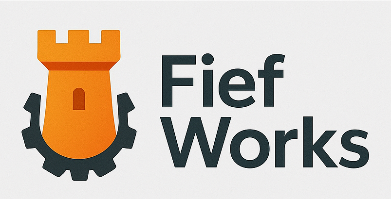

# 🧘 Stay Calm and Prompt On (SCAPO)

<div align="center">


**The Zen Guide to AI Model Best Practices**

[](https://github.com/czero-cc/scapo)
[]()
[]()
[]()
[]()
[](CONTRIBUTING.md)

### 🎯 Stop stressing about prompts. We got you.

</div>

## 🤔 What is SCAPO?

Ever found yourself like this when trying to get AI to work?


**SCAPO** (Stay Calm and Prompt On) is your zen master for AI model best practices. We automatically scrape, analyze, and organize prompting wisdom from across the internet - so you don't have to.

## ✨ Features That'll Make You Say "Finally!"

- 🕷️ **Intelligent Browser Scraping** - No API keys needed. Just pure browser automation magic.
- 🧠 **LLM-Powered Extraction** - Your selected LLMs read the internet so you don't have to.
- 🎯 **Automatic Categorization** - Text, image, video, audio models all organized nicely.
- 🔌 **Claude Desktop Integration** - MCP server that just works™️
- 🚀 **Zero Config** - Literally just run it. We're not kidding.
- 🖥️ **Interactive TUI** - Navigate content with arrow keys in a beautiful terminal interface.

## 🏃‍♂️ Quick Start (60 Seconds or Less)

### 1. Clone & Install
```bash
git clone https://github.com/czero-cc/scapo.git
cd scapo
curl -LsSf https://astral.sh/uv/install.sh | sh  # Install uv
uv venv && source .venv/bin/activate  # On Windows: .venv\Scripts\activate
uv pip install -e .  # Install scapo and dependencies
uv run playwright install  # Install browser automation
```

### 2. Explore Your Collected Content
```bash
# Launch the interactive model explorer to browse collected best practices
uv run scapo tui

# Navigate with arrow keys, press Enter to view content
# Press 'q' to quit, 'h' for help
```

### 3. Configure Your LLM Provider

SCAPO supports **three LLM providers** for processing scraped content:

#### Option A: OpenRouter (Recommended - Cloud)
```bash
cp .env.example .env
# Edit .env and set:
# LLM_PROVIDER=openrouter
# OPENROUTER_API_KEY=your_api_key_here
# OPENROUTER_MODEL=anthropic/claude-3.5-haiku  # or any model from openrouter.ai
```
Get your API key from [openrouter.ai](https://openrouter.ai/)

#### Option B: Ollama (Local)
```bash
# Install and start Ollama
ollama serve
ollama pull llama3  # or any model you prefer

cp .env.example .env
# Edit .env and set:
# LLM_PROVIDER=local
# LOCAL_LLM_TYPE=ollama
# LOCAL_LLM_URL=http://localhost:11434
# LOCAL_LLM_MODEL=llama3
```

#### Option C: LM Studio (Local)
```bash
# Start LM Studio and load a model

cp .env.example .env
# Edit .env and set:
# LLM_PROVIDER=local
# LOCAL_LLM_TYPE=lmstudio
# LOCAL_LLM_URL=http://localhost:1234
# LOCAL_LLM_MODEL=any  # LM Studio ignores this
```

> **⚠️ Important: LLM Model Requirements**  
> SCAPO uses advanced LLM features for quality filtering and practice evaluation. For best results:
> - **Recommended**: Models with 7B+ parameters (e.g., Llama 3 8B, Qwen 2.5 7B, Mistral 7B)
> - **Minimum**: 3B+ parameters with good instruction following
> - **Not Recommended**: Tiny models (<3B) may produce poor quality extractions
> 
> The LLM needs to:
> - Understand context and nuance
> - Evaluate if practices are model-specific vs generic
> - Extract structured JSON reliably
> - Make quality judgments about technical content

### 4. Run the Scraping Pipeline
```bash
# Install the scapo CLI
uv pip install -e .

# Initialize SCAPO (check setup)
uv run scapo init

# Scrape and process with your configured LLM
scapo scrape run --sources reddit:LocalLLaMA --limit 10

# Or with uv (if not installed globally)
uv run scapo scrape run --sources reddit:LocalLLaMA --limit 10

# Run scheduled scraping (every SCRAPING_INTERVAL_HOURS)
uv run scapo schedule

# List available sources
uv run scapo sources

# Remember: Be respectful! Adjust SCRAPING_DELAY_SECONDS in .env if needed.
```

The pipeline will:
1. 🌐 Browse Reddit/HackerNews using Playwright (no API keys!)
2. 🧠 Extract AI-related content using your LLM
3. 📝 Extract best practices from relevant posts
4. 💾 Save to organized model directories
5. 🔧 Filter parameters to only include model-specific data

### 5. Use with Claude Desktop
```bash
npx @scapo/mcp-server  # That's it. Seriously.
```

## 🎨 The SCAPO Philosophy

```
1. No API keys required (we're rebels like that)
2. Community wisdom > Corporate docs (for GenAI, yes!)
3. If it's not automatic, it's not worth it
4. Browser scraping > API begging
5. Be respectful when scraping - don't hammer servers
```

## 🛠️ How It Works (The Magic Behind the Calm)

### 1. 🕸️ Intelligent Scraping
We use Playwright to browse the web like a human (but faster):
- Reddit discussions
- Hacker News debates
- GitHub repositories
- Any public forum

### 2. 🧠 Three-Stage LLM Processing
```python
# Stage 1: "Is this even about AI?"
entities = extract_entities_with_llm(content)
if not entities.is_ai_related:
    return  # Skip non-AI content

# Stage 2: "What can we learn?"
practices = extract_best_practices(content, entities)

# Stage 3: "Is this actually useful?" (Quality Filter)
for practice in practices:
    quality_score = evaluate_practice_quality(practice, model_name)
    if quality_score < 0.6:  # Configurable threshold
        continue  # Skip generic "use clear prompts" advice
```

This quality filtering ensures you only get **model-specific**, **actionable** practices - not generic AI tips that apply to everything.

> **📊 Progress Tracking**: When using local LLMs, quality evaluation can take time. SCAPO shows progress messages with estimated time remaining. Consider using OpenRouter for faster processing or lowering `LLM_QUALITY_THRESHOLD` if needed.

### 3. 📁 Smart Organization
```
models/
├── text/
│   ├── Qwen3-Coder-Flash/
│   │   ├── prompting.md      # "Use XML tags for structure"
│   │   ├── parameters.json   # {"temperature": 0.2}
│   │   └── pitfalls.md      # "Don't set temp too high"
├── image/
│   └── stable-diffusion-xl/
└── video/
    └── runway-gen3/
```

## 🖥️ Interactive Model Explorer (TUI)

The `scapo tui` command launches an interactive terminal interface for exploring and reading the model content collected by SCAPO:

```bash
uv run scapo tui
```

### What You Can Explore
- **📁 Model Categories**: Browse text, image, video, audio, and multimodal models
- **📝 Best Practices**: Read prompting guides and tips for each model
- **⚙️ Parameters**: View recommended settings and configurations
- **⚠️ Pitfalls**: Learn what to avoid when using specific models
- **📊 Metadata**: Explore model information and file statistics

### Navigation
- **↑/↓** - Navigate through the model tree
- **→/Enter** - Expand categories or select items
- **←** - Collapse categories or go back
- **q** - Quit the TUI
- **h** - Show help
- **r** - Refresh the model tree

### Content Display
- **Markdown Rendering**: Full formatting for prompting guides and best practices
- **JSON Tables**: Structured table view for parameters and metadata
- **File Information**: See file sizes, types, and available content
- **Model Overview**: Summary of all available files for each model

### Features
- **Tree Navigation**: Hierarchical view of all collected models
- **Rich Content Viewing**: Proper rendering of markdown and structured data
- **File Type Icons**: Visual indicators for different content types
- **Responsive Layout**: Adapts to terminal size and content type
- **Keyboard Shortcuts**: Full keyboard navigation support

### Content Types
- **📝 Markdown (.md)**: Best practices, prompting guides, pitfalls
- **⚙️ JSON (.json)**: Parameters, metadata, examples
- **📋 YAML (.yml/.yaml)**: Configuration files
- **📄 Other**: Raw content with syntax highlighting

## 🎮 MCP Server for Claude Desktop

### Installation (One Line!)
```json
{
  "mcpServers": {
    "scapo": {
      "command": "npx",
      "args": ["@scapo/mcp-server"],
      "env": {
        "SOTA_MODELS_PATH": "/path/to/scapo/models"
      }
    }
  }
}
```

### What You Can Ask Claude
- "What are the best practices for Qwen3-Coder?"
- "Search for models good at coding"
- "List all available image models"
- "Recommend models for creative writing"

## 🌟 Real Examples from the Wild

### Found on Reddit
```markdown
## Qwen3-Coder-Flash Prompting

"Discovered this today - XML tags are GAME CHANGING for code:
<task>implement binary search</task>
<requirements>
- Use type hints
- Add docstring
- O(log n) complexity
</requirements>"

Confidence: 0.9
Source: reddit:LocalLLaMA
```

### Extracted from HackerNews
```json
{
  "model": "DeepCoder-14B",
  "practice_type": "parameter",
  "content": "Set repetition_penalty to 1.15 for less repetitive code",
  "confidence": 0.85
}
```

## 📊 Stats That Matter

- 🔍 **Sources Monitored**: Reddit, HN, GitHub (more coming!)
- 🤖 **Models Tracked**: 50+ and growing daily
- 📈 **Practices Extracted**: 1000+ actionable tips
- ⚡ **Processing Time**: ~2s per post with local LLM

## ⚙️ Configuration Details

### Environment Variables (.env)

```bash
# LLM Provider Configuration
LLM_PROVIDER=openrouter              # Options: openrouter, local
LLM_PROCESSING_ENABLED=true          # Enable/disable LLM processing

# OpenRouter (if using cloud)
OPENROUTER_API_KEY=your_key_here     # Get from openrouter.ai
OPENROUTER_MODEL=anthropic/claude-3.5-haiku  # Any model from openrouter.ai

# Local LLM (if using Ollama or LM Studio)
LOCAL_LLM_URL=http://localhost:11434 # Ollama: 11434, LM Studio: 1234
LOCAL_LLM_MODEL=llama3               # Model name (ignored by LM Studio)
LOCAL_LLM_TYPE=ollama                # Options: ollama, lmstudio

# Processing Limits
LLM_MAX_CHARS=4000                   # Max chars to send to LLM
LLM_CHAR_HARD_LIMIT=50000           # Absolute safety limit
LLM_QUALITY_THRESHOLD=0.6            # Min quality score (0.0-1.0) for practices

# Scraping Configuration
SCRAPING_INTERVAL_HOURS=6            # For scheduled/periodic scraping (not yet in CLI)
MAX_POSTS_PER_SCRAPE=100            # Max posts per source
MIN_UPVOTE_RATIO=0.8                # Quality filter for Reddit
SCRAPING_DELAY_SECONDS=2            # Delay between pages (be respectful!)

# Logging
LOG_LEVEL=INFO                       # DEBUG, INFO, WARNING, ERROR
LOG_FORMAT=json                      # json or text
```

### Supported Models

#### OpenRouter Models (Cloud)
- `anthropic/claude-opus-4` - World's best coding model (200K context)
- `anthropic/claude-sonnet-4` - State-of-the-art performance
- `anthropic/claude-3.5-haiku` - Fast and affordable
- `anthropic/claude-3.7-sonnet:thinking` - Hybrid reasoning model
- `openai/gpt-4-turbo` - High quality
- `deepseek/deepseek-r1` - Reasoning model
- `deepseek/deepseek-r1:free` - Free reasoning model!
- `meta-llama/llama-3.1-70b-instruct` - Open source powerhouse
- Any model listed on [openrouter.ai/models](https://openrouter.ai/models)

#### Local Models (Ollama or LM Studio)
SCAPO works with any local LLM server. For best results:
- **Recommended**: 7B+ parameter models for accurate content extraction
- **Minimum**: 3B parameters (may have lower accuracy)

Popular local model servers:
- **Ollama**: [ollama.com](https://ollama.com) - Port 11434
- **LM Studio**: [lmstudio.ai](https://lmstudio.ai) - Port 1234

The LLM is used to extract best practices from scraped content. Larger models generally provide better extraction quality and fewer false positives.

## 🚀 Advanced Usage

### Source Configuration

SCAPO uses a modular source configuration system via `src/scrapers/sources.yaml`:

```yaml
reddit:
  sources:
    - name: "r/LocalLLaMA"
      url: "https://www.reddit.com/r/LocalLLaMA/"
      priority: high  # high/medium/low
      models: ["llama", "mistral", "general"]
```

**Default behavior**:
- Without `--sources`: Uses high-priority sources from sources.yaml
- With `--sources`: Scrapes only specified sources
- Run `scapo sources` to see all available sources

### Custom Sources
```python
# Add your own scraper in intelligent_browser_scraper.py
async def scrape_mycommunity_browser(self, page: Page):
    await page.goto("https://mycommunity.com")
    # Your scraping logic here
```

### Batch Processing
```bash
# List all available sources (loaded from sources.yaml)
uv run scapo sources

# Scrape specific sources
uv run scapo scrape run \
  --sources reddit:LocalLLaMA reddit:OpenAI hackernews \
  --limit 20

# Use default high-priority sources (auto-selected from sources.yaml)
scapo scrape run --limit 10

# Or with uv
uv run scapo scrape run \
  --sources reddit:LocalLLaMA reddit:OpenAI hackernews \
  --limit 20

# Tip: Adjust SCRAPING_DELAY_SECONDS in .env for faster/slower scraping
```

### Browse Models
```bash
# List all models (default simple view - one per line)
uv run scapo models list

# List all models in card view (limited to 8 per category)
uv run scapo models list --cards

# List models by category
uv run scapo models list --category text

# Display as tree structure
uv run scapo models list --tree

# Search for specific models
uv run scapo models search "llama"

# Get detailed info about a model
uv run scapo models info llama-3 --category text

# Interactive TUI for exploring model content
uv run scapo tui
```

### Interactive TUI Explorer
```bash
# Launch the interactive model explorer
uv run scapo tui
```

The TUI provides:
- 📁 **Tree Navigation**: Browse models by category
- 📝 **Markdown Rendering**: View prompting guides and best practices
- ⚙️ **JSON Tables**: Explore parameters and metadata in table format
- 🔍 **File Information**: See file sizes and types
- ⌨️ **Keyboard Navigation**: Use arrow keys and Enter to explore

**Keyboard Shortcuts:**
- `q` - Quit the TUI
- `h` - Show help
- `r` - Refresh model tree
- Arrow keys - Navigate
- Enter - Select item

### Export Practices
```bash
# Export to your favorite format
uv run scapo export --format obsidian --model gpt-4
```

## 🤝 Contributing

We're building the Wikipedia of AI prompting. Join us!

### Easy Contributions
1. 🔗 **Add a Source** - Know a great AI community? Add it!
2. 💡 **Share a Practice** - Found a killer prompt? Share it!
3. 🐛 **Report Issues** - Something broken? Let us know!
4. ⭐ **Star the Repo** - Spread the calm!

### Dev Setup
```bash
make install  # Set everything up
make test     # Run tests
make scrape   # Test scraping
```

## 🎯 Things We Might Do Later

- [ ] YouTube transcript extraction
- [ ] Discord server monitoring
- [ ] Real-time practice updates
- [ ] Practice voting system
- [ ] Chrome extension
- [ ] VS Code integration

## 🔧 Troubleshooting

### OpenRouter Issues
- **502 Bad Gateway**: Try a different model or check your API key
- **Rate limits**: OpenRouter has generous limits, but space out requests
- **No response**: Check your internet connection and API key

### Local LLM Issues
- **Ollama not responding**: Make sure `ollama serve` is running
- **Model not found**: Run `ollama pull <model_name>` first
- **LM Studio timeout**: Ensure a model is loaded in LM Studio
- **Out of memory**: Try a smaller model or quantized version
- **Poor quality extractions**: Small models (<7B) may struggle with quality evaluation
  - Solution 1: Use a larger model (7B+ recommended)
  - Solution 2: Lower `LLM_QUALITY_THRESHOLD` to 0.4 in `.env`
  - Solution 3: Switch to OpenRouter for better quality

### Scraping Issues
- **No practices extracted**: The LLM might be too conservative. Try adjusting relevance thresholds
- **Playwright errors**: Run `uv run playwright install` to reinstall browsers
- **Timeout errors**: Some sites load slowly. Be patient!


## 📚 Documentation

- [Configuration Guide](docs/CONFIGURATION.md) - All settings and environment variables explained
- [Quick Start Guide](QUICKSTART.md) - Get up and running in 5 minutes
- [Contributing Guide](CONTRIBUTING.md) - How to add sources and contribute
- [Add New Source Tutorial](docs/ADD_NEW_SOURCE.md) - Step-by-step guide

## 📜 License

MIT - Because sharing is caring. 

Built as part of the CZero Engine project to improve AI application development.

## 🙏 Acknowledgments

- The open source AI/LLM communities for blazing the trail
- The r/LocalLLaMA community for being awesome
- LM Studio & Ollama for making local LLMs accessible
- OpenRouter for cloud AI serving
- Claude for the MCP protocol
- Coffee ☕ for making this possible

---

<div align="center">

### Remember: Stay Calm and Prompt On 🧘

**Built with ❤️ by The [CZero Engine](https://czero.cc) Team**



[Contact](mailto:info@czero.cc) • [CZero](https://czero.cc)

</div>
